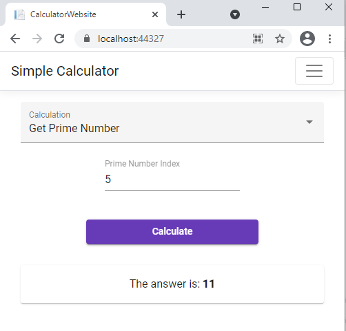

# GL Programming Challenge
## Implementation
For this programming challenge, I used a C# api with an Angular front-end. I modelled the database using entity framework core and added a method to the program of the web app so the database will be deployed locally on running. All tasks (as detailed below) were attempted.

**Visual Studio can be used to run the solution, by setting `CalculatorWebsite` as the StartUp Project.**

Note: Your visual studio may need updates and `node.js` to work, on first run of the application it may take a few mins to restore npm dependencies and deploy database, if a time-out / python error occurs, please try running the application again.

### Projects
* **CalculatorDatabase:** Contains the EF Core code to describe the database, via `CalculatorContext.cs` *(SQL Server Task)*.
* **CalculatorLibrary:** Contains the C# library to implement the Calculator *(Visual Studio & C# Tasks)*.
* **CalculatorLibraryTests:** Contains the unit tests for the calculator *(TDD Task)*.
* **CalculatorWebsite:** Contains the Angular website *(Web Task)*.

### Screenshots of Web App




### Further Work

* The solution needs to incorporate validation on the inputs that prevents the user from inputting a number outside of int range.
* The solution needs to incorporate handling errors on the front-end to inform the user that something went wrong.
* An additional page that returns the logs from the database, could be a nice implementation to use the database more effectively.

## Tasks

### Git
* Upload code to Github and share

### Visual Studio
* Create an empty solution called CalculatorTest.
* Create a class library containing the interface below.

``` C#
public interface ISimpleCalculator
{
    int Add(int start, int amount);
    int Subtract(int start, int amount);
    int Multiply(int start, int by);
    float Divide(int start, int by);
}
```

* Create a C# class to realize the interface as a C# class.

### TDD
* Create a class library containing a suite of unit tests for the interface using test-driven design principles.

### C#
* Add a diagnostics interface to the calculator class to allow each method to report its
calculation results to the debugger.
* Mock the diagnostics interface and use it to refactor the unit tests so that the test suite
checks that the diagnostics interface is called with expected values.

### SQL Server
* Create a basic database and update the application to include a new implementation of the
Diagnostics interface which will write the diagnostics information to the database.

### Web
* Create a simple web service that provides access to a calculator implementation via a REST
API using HTTP.
* Create a Web App to invoke the Calculator Web Service (extra points for using Angular)
* (Optional) Create a new calculator method called GetPrimeNumber which will accept an
integer to denote which prime number to return (assuming prime numbers are
2,3,5,7,11,13.. passing in 4 would return the 4 th prime number which is 7).
